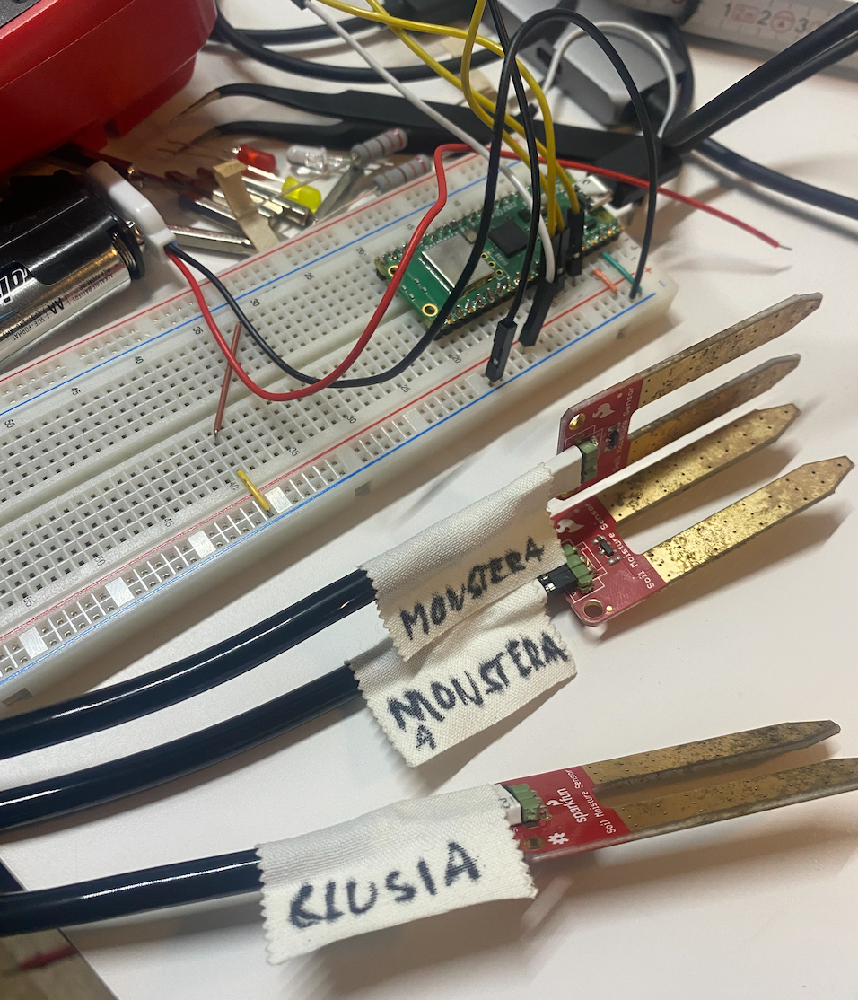
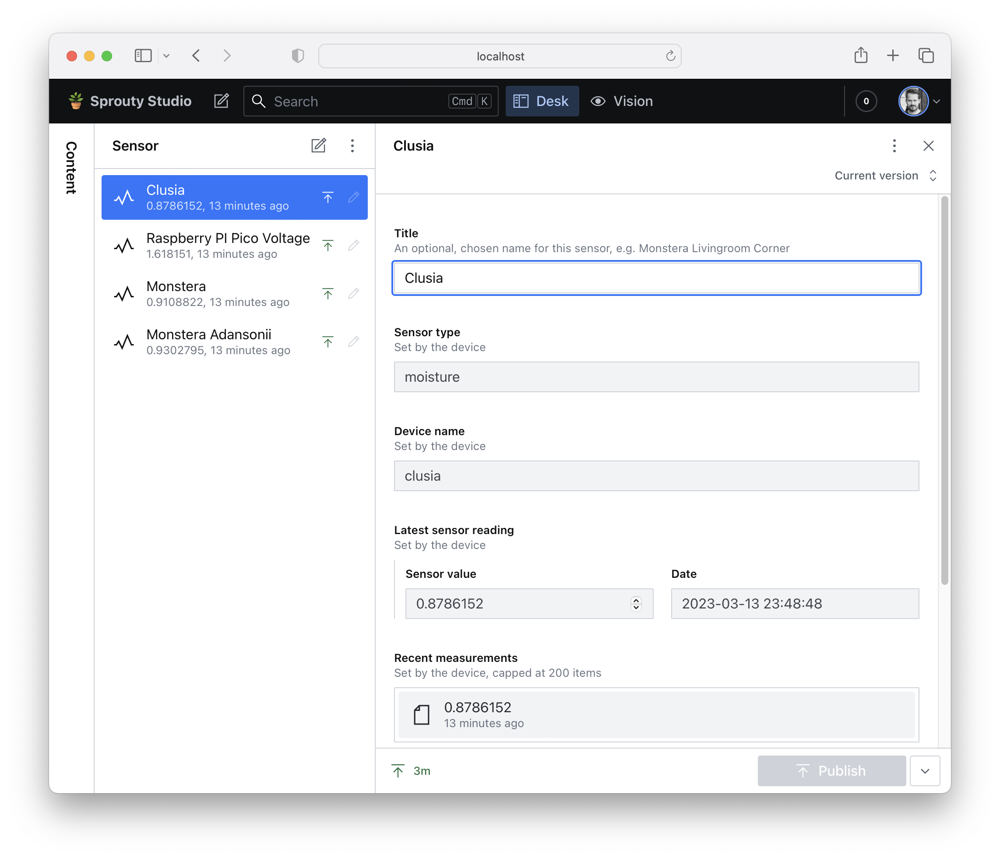

# 🪴 Sprouty

Use a Wi-Fi enabled Raspberry PI Pico W to measure the soil moisture in your potted plants and store the measurements
in the [Sanity](https://www.sanity.io/) Content Cloud.

Read soil moisture levels for up to three capacitive moisture sensors at a configured interval and store these levels in
a Sanity document.

# What you'll need

- Raspberry PI Pico W ([how to buy](https://www.raspberrypi.com/products/raspberry-pi-pico/))
- Soil moisture sensor(s) (you can connect up to 3 to one Raspberry PI Pico W), for example [SparkFun SEN-13322](https://www.sparkfun.com/products/13322)
- Various jumper wires, connectors, breadboard, etc. See [this guide](https://peppe8o.com/capacitive-soil-moisture-sensor-with-raspberry-pi-pico-wiring-code-and-calibrating-with-micropython/) for an example of how to hook up a moisture sensor to a Raspberry PI Pico

# Quickstart

First, make a [fork](https://docs.github.com/en/get-started/quickstart/github-glossary#fork) of this repository to your personal GitHub account and [clone](https://docs.github.com/en/get-started/quickstart/github-glossary#clone) it to your local computer.

## Setup the Sanity Content Cloud & Content Studio

The Sanity Content Cloud offers a convenient way to store and read the sensor measurements, and the Raspberry PI Pico W will post sensor updates directly there. The Sanity Content Studio allows you to easily view and edit the sensor data stored in the Content Cloud.

1. Go to https://sanity.io/get-started/create-project and get your project ID and dataset
2. Copy `.env.example` in the `studio`-folder to `.env` and replace the sample values with the project id and dataset from the previous step
3. Run the Content Studio locally with `npm run dev`

## Getting started with the Raspberry PI Pico W

Once the board and sensors are hooked up, you are ready to deploy the MicroPython app to the Raspberry PI so it can measure and send sensor measurements at regular intervals to the Sanity Content cloud.

- Install [MicroPython](https://micropython.org/download/rp2-pico-w/) on your Raspberry PI Pico W.
- Go to the `board` folder and copy `config.example.py` to `config.py` and change the config according to your Sanity config.
- Connect to the Raspberry PI and load the program onto it. There are several options here:
  - [Thonny](https://projects.raspberrypi.org/en/projects/getting-started-with-the-pico/4)
  - [Pyboard](https://docs.micropython.org/en/latest/reference/pyboard.py.html)
  - [PyCharm](https://www.jetbrains.com/pycharm/) with the [MicroPython plugin](https://github.com/JetBrains/intellij-micropython)
  - [VSCode](https://code.visualstudio.com/) with the [MicroPython plugin](https://marketplace.visualstudio.com/items?itemName=dphans.micropython-ide-vscode)

### Set up the Raspberry Pico W and calibrate sensors
1. Open `config.py` in the `board/` folder and set the `PROGRAM_MODE` to `setup`
2. Flash the device with all the files contained in the `board` folder. Make sure you enable the REPL, so you can see logs and debug if something goes wrong.
3. (Optional) Open `config.py` again and change `PROGRAM_MODE` to `calibrate`. This will allow you to find the min/max values of the moisture sensors (make sure to have a glass of water readily available).
4. Flash the device again as in step 2
5. Open `config.py` in the `board/` folder and set the `PROGRAM_MODE` to `app`
6. Flash the device again as in step 2. The PI will now read sensor levels at the configured interval and post updates to your Sanity Content Cloud dataset.

# Resources

- [Getting started with the Raspberry PI Pico W](https://projects.raspberrypi.org/en/projects/get-started-pico-w)
- [MicroPython Raspberry Pi Pico reference](https://docs.micropython.org/en/latest/rp2/quickref.html)
- [Create a soil moisture sensor with a Raspberry Pi Pico and an LED ring](https://andywarburton.co.uk/2021/pi-pico-soil-moisture-indicator/)
- [Powering the Raspberry PI Pico from External Batteries](https://peppe8o.com/powering-the-raspberry-pi-pico-from-external-batteries/)

# Images

